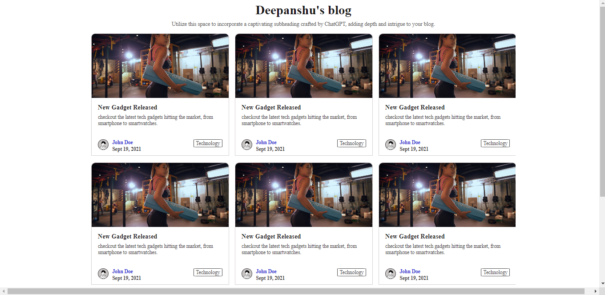

# Deepanshu's Blog

This is a simple blog layout created using HTML and CSS.

## Project Overview

This project includes a blog layout with multiple card components showcasing various blog posts. Each card contains an image, title, description, author information, and tags related to the post.

## Preview

## How to Run

To run this project on your local machine, follow these steps:

1. Download the zip folder by clicking on code.
2. Extract the zip folder.
3. run index.html file.

## Project Structure

1. index.html : Main HTML file containing the blog layout.
2. tyle.css : CSS file for styling the blog components.

## Technologies Used
1. HTML5
2. CSS3
3. Google Fonts API
4. Unsplash API (for placeholder images)
5. DiceBear API (for avatar images)

## Author
Deepanshu - [https://github.com/Deepanshu1337]
